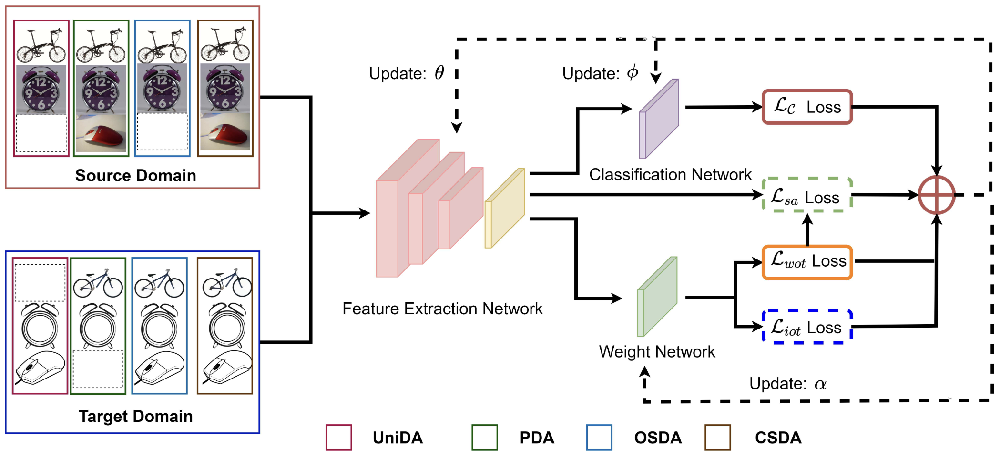

# A Versatile Framework for Unsupervised Domain Adaptation based on Instance Weighting

Code release for **A Versatile Framework for Unsupervised Domain Adaptation based on Instance Weighting**.



## Requirements
* Python 3.7+
* PyTorch 1.8.0
* GPU Memory 12 GB

To install requirements:

```
pip install -r requirements.txt
```

## Preparation
* Download the dataset: [Office31](https://faculty.cc.gatech.edu/~judy/domainadapt/), [OfficeHome](https://www.hemanthdv.org/officeHomeDataset.html), [VisDA](https://github.com/VisionLearningGroup/taskcv-2017-public/tree/master/classification) and [DomainNet (real, painting and sketch)](http://ai.bu.edu/M3SDA/).
* Prepare dataset in data directory as follows
    ```
    /path/to/your/office31/amazon/      # Office
    /path/to/your/office_home/RealWorld/          # OfficeHome 
    /path/to/your/VisDA/source/              # VisDA synthetic images
    /path/to/your/VisDA/target/               # VisDA real images
    /path/to/your/domainnet/sketch/             # DomainNet
    ```

* For OfficeHome dataset, make sure that your folder name is `RealWorld` instead of `Real World`.
* Modify `root_path` with `/path/to/your/dataset/` in config files `./config/<dataset>-config.yaml`.
* Make a log directory by ```mkdir ./log```.
* Make a model directory by ```mkdir ./model```. Download ImageNet pretrained model from [Google Drive](https://drive.google.com/file/d/1wWsZYeQ3b1Zd5R5TRmVeAxYlEU3KHuy2/view?usp=sharing), then put the downloaded model into ```./model```. 

## Getting started
* Train with command line (take `office` for example)
    ```
    python main.py --gpu 0 --exp office31 --dataset office31 --source amazon --target dslr

## Citation
If you find this repository useful in your research, please consider citing:

```
@article{zhu2023unified,
  title={A Unified Framework for Unsupervised Domain Adaptation based on Instance Weighting},
  author={Zhu, Jinjing and Ye, Feiyang and Xiao, Qiao and Guo, Pengxin and Zhang, Yu and Yang, Qiang},
  journal={arXiv preprint arXiv:2312.05024},
  year={2023}
}

